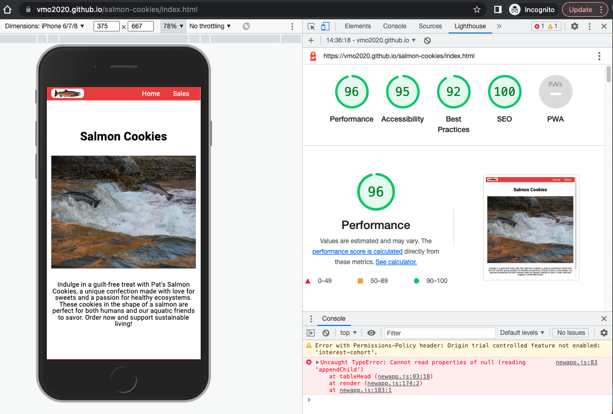

# salmon-cookies

[Github link](https://github.com/VMO2020/salmon-cookies)

[WEB link](https://vmo2020.github.io/salmon-cookies/index.html)

## Description

This is a website for Pat's Salmon Cookies, to evaluate Pat's estimates from five stores (Seattle, Tokyo, Dubai, and Lima) and make a table of quantities of cookies purchased for stores and times of day.
Additional Features: Calculate total cookies daily per store, Tossers required and a mock store and admin page.

### Lighthouse Accessibility

